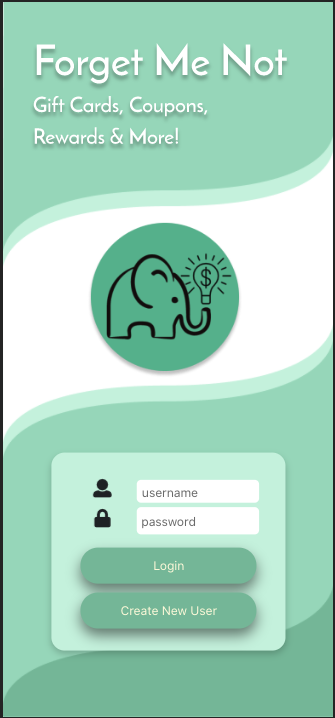
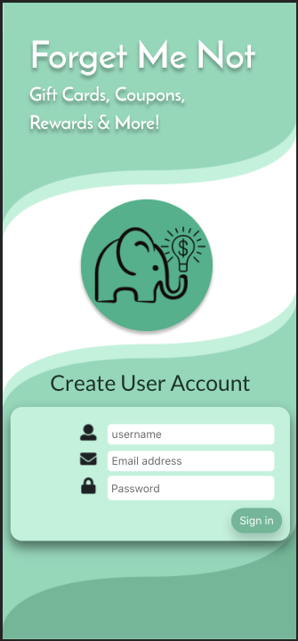
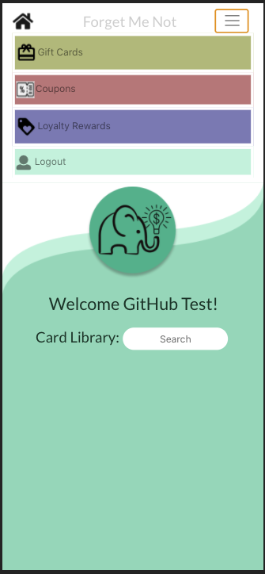
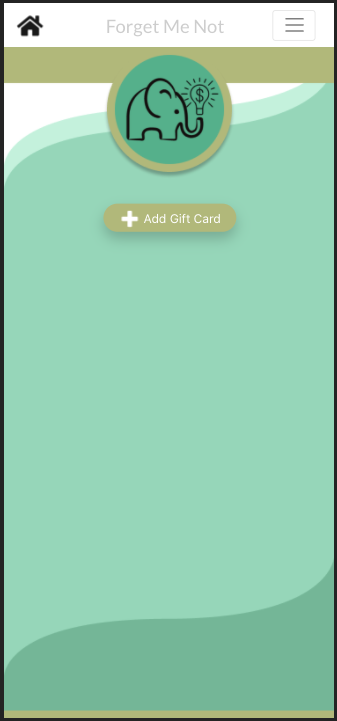
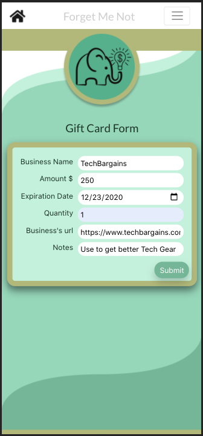
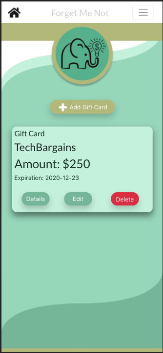
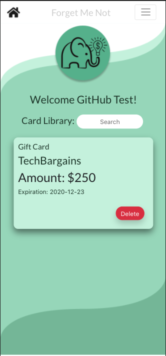

Gift Cards, Coupons, & Loyalty Rewards Tracker

**Description:** I created an app that allows users to build a virtual wallet that can fast sort their Gift Cards, Coupons and Rewards as well as track important information such as expiration dates.

**Purpose:** I like to be smart with my money and hate forgetting to use the various of Gift Cards, Coupons, & Loyalty Rewards in my wallet. One of the big obstacles I have to using my cards is that there are so many it's hard to remember what I have. I also regularly forget other important details such as when they expire or what I intended to use them for. This App is a way to help organize all this information so that users can quickly know what they have available for use.

---

### **To run this marvelous code:**

1. Clone it down

1. Go to your terminal of choice and create a new folder
1. Copy the SSH key in git hub
1. In your terminal write: git clone `git@github.com:leigharobinson/ForgetMeNot.git`

1. Launch from Terminal

1. `cd` into forgetMeNot
1. `npm install`
1. `npm start` \*If doesn't open automatically then paste http://localhost:3000 in your browser.

1. Now Launch JSON file

1. `cd forgetMeNot/api`
1. `json-server -p 5005 -w forgetMeNot.json

### **Using the App:**

---

- Register an account (\*) Note: this is not true authentication. DO NOT STORE SENSITIVE INFORMATION! Email addresses are saved openly in the JSON database and not protected.f

1. Click "Create New User" btn
2. Fill Out "Create User Account" form and then Sign in

 

1. Once You're Signed in, click Navbar and select what Card you would like to add to "Forget Me Not"

2. For this demonstration, I will select Gift Card

3. Once on Gift Card select the "Add Gift Card" btn
4. Then fill out the Gift Card Form & press Submit

5. Now that your form has been submitted, a virtual card representation of your physical card will display on the "Gift Card page" as well as the "Main page."

Access the "Main page" by clicking the house icon

 

6. Buttons accessible on different pages of the App allow for the functionality of the word written on them. Cards can be created, read, updated, updated, and deleted.
7. Once the User has added multiple cards of different types and for different businesses, the "Home Page" has a Search input that allows for quick sorting of all of the User's Cards. Cards are also by default listed alphabetically by the establishment's name.

### **Technologies Used**

---

To build this app the following were used:

- This project was bootstrapped with [Create React App](https://github.com/facebook/create-react-app).

- [Semantic UI](https://react.semantic-ui.com/) for icons
- [React Router](https://reacttraining.com/react-router/) for page routing
- [Reactstrap](https://reactstrap.github.io/components/navbar/)
- [BootStrap](https://getbootstrap.com/) for buttons and to enable Reactstrap

### Skills Utilized

1. API Calls: POST, PUT, DELETE, GET
1. JavaScript: Objects, Arrays, Functions, etc.
1. Persistent data storage with JSON server
1. Github Scrum workflow
1. CSS
1. Semantic HTML
1. React: hooks, props, routes
1. Modular code

## Troubleshooting

If you are having trouble getting the application running:

- Double check your file paths to make sure they are in the right directories
- Make sure all dependencies are installed
- Check to make sure your servers are correct. Should be `localhost:3000` for app and `localhost:5005` for the JSON server.
- Contact me through my linkedin and I would be happy to try and help (https://www.linkedin.com/in/leigha-robinson/)
